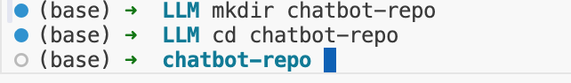
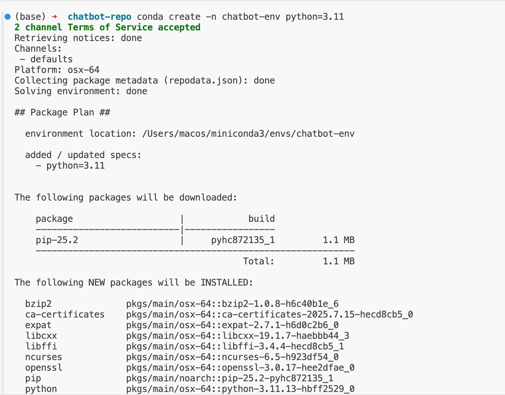
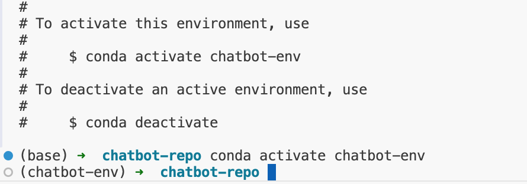
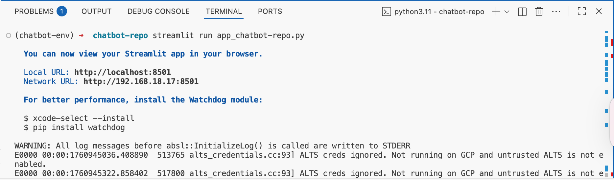
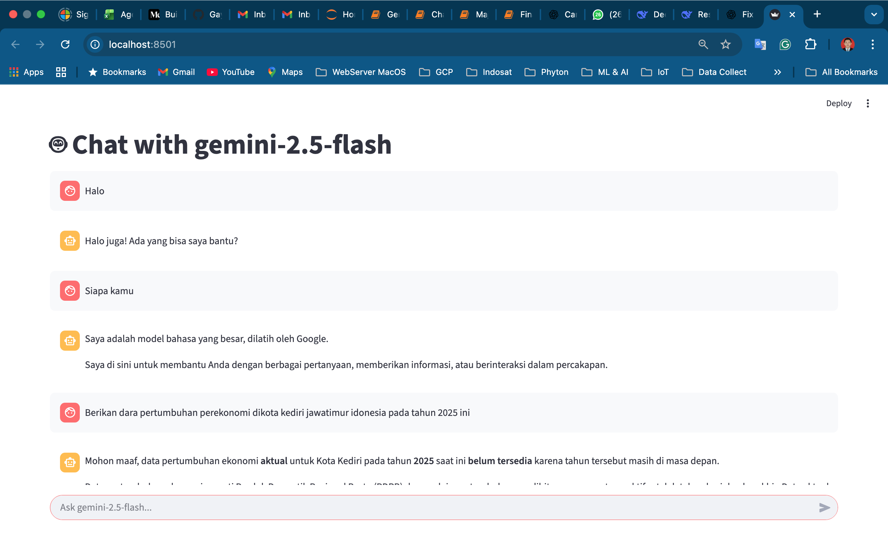

# Chatbot-with-gemini-2.5-flash
Kami akan memandu Anda melalui proses pembuatan aplikasi chatbot menggunakan Streamlit dan model AI Generatif Google, Gemini-2.5-flash. Kami akan membahas semuanya, mulai dari pengaturan lingkungan hingga integrasi Gemini API dan pengoperasian chatbot.

- [x] Pertama, kita perlu menyiapkan lingkungan proyek. Kita akan menggunakan environment.ymlberkas tersebut untuk membuat lingkungan Conda dengan semua dependensi yang diperlukan.
      
<div><center>
</center>
</div>

## Installing Dependencies
- [x] To create the Conda environment, run the following command to Set up the virtual environment Use conda to create a virtual environment based on the environment.yml file:

<div><center>
</center>
</div>

<div><center>
</center>
</div>

- This command will create a new environment named `chatbot-env` with the specified dependencies. Alternatively, you can use **requirements.txt** to install dependencies via pip:

## Creating the Chatbot

**Project Structure**
The project consists of foolowing files:

- `app_chatbot-repo.py`: The main Streamlit application.
- `functions.py`: Contains helper functions for interacting with the Gemini API.
- `environment.yml` and `requirements.txt`: Used for setting up the environment.
- `README.md`: Provides an overview and instructions for the project.

```
chatbot-repo/
│
├── .env                             # API keys and environment variables
├── function.py                      # Contains helper functions for interacting with the Gemini API.
├── app_chatbot-repo.py              # The main Streamlit application.
├── environment.yml                  # Used for setting up the environment.
├── requirements.tx                  # Used for setting up the environment.
└── README.md                        # rovides an overview and instructions for the project.
```

### Aplikasi Utama

Mari kita mulai dengan melihat berkas aplikasi utama. `app_chatbot-repo.py` Berkas ini mengatur antarmuka Streamlit dan menangani interaksi pengguna.

### Helper Functions

Fungsi pembantu didefinisikan dalam functions.py. Fungsi-fungsi ini berinteraksi dengan API Gemini untuk mendapatkan respons berdasarkan masukan pengguna.

### Menjalankan Aplikasi
Untuk menjalankan aplikasi, gunakan perintah berikut:

<div><center>
</center>
</div>

### Menjalankan Aplikasi
Untuk menjalankan aplikasi, gunakan perintah berikut:

<div><center>
</center>
</div>

<div><center>
</center>
</div>
